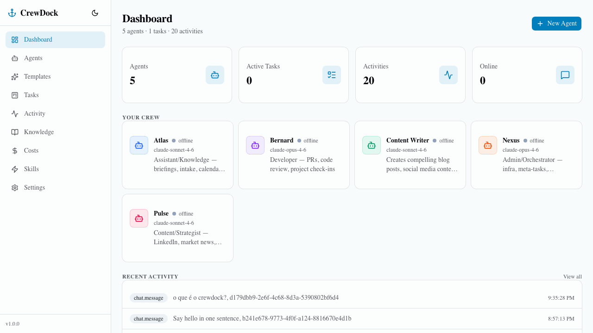
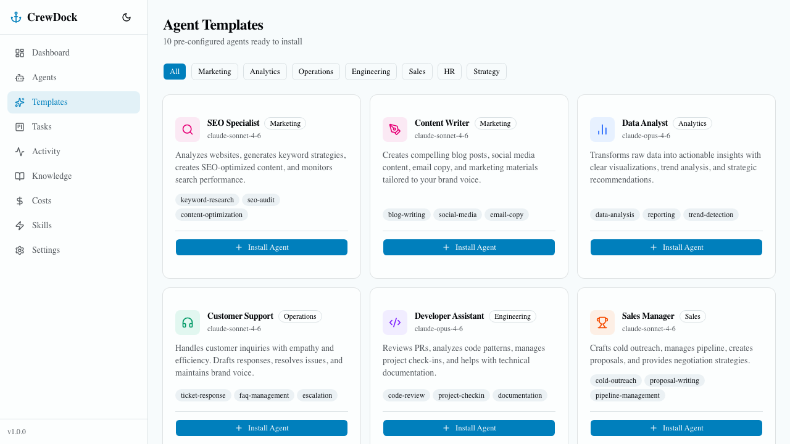

# CrewDock

Open-source control plane for operating focused AI agents. CrewDock gives teams
one self-hosted place to manage agent roles, task state, approvals, activity
streams, knowledge context, and cost visibility.

Built by [Felhen](https://felhen.ai), an applied AI company building governed AI
operating systems for real businesses.



## Why CrewDock?

Most teams start with a powerful agent in a terminal. That works until the work
needs coordination, memory, approvals, observability, and a clear operating
model. CrewDock is the open-source base layer for that next step.

- **Focused agents** — create agents with explicit roles, models, prompts, and responsibilities
- **Operational surface** — chat, tasks, approvals, schedules, activity, and costs in one place
- **Knowledge-aware execution** — agents search your document base before responding
- **Governed autonomy** — human-in-the-loop workflows and audit trails for agent actions
- **Self-hosted by default** — Docker Compose, portable stack, no vendor lock-in

## Features

### Core
- **Multi-agent management** — create agents with custom system prompts, models, and roles
- **Agent chat with streaming** — real-time token-by-token responses via SSE
- **Knowledge base integration** — agents search your documents (QMD) before responding
- **Task orchestration** — Kanban board with drag-and-drop, cron scheduling, state machine
- **Real cost tracking** — actual token usage recorded from API calls
- **Agent templates** — 10 pre-configured agents across 6 categories, one-click install

### Platform
- **JWT authentication** — email/password login with setup flow for first user
- **Task scheduler** — APScheduler executes recurring tasks via LLM
- **Persistent chat history** — Redis-backed with in-memory fallback
- **Activity feed** — real-time event stream via Server-Sent Events
- **Approval workflows** — human-in-the-loop for agent actions
- **Webhook notifications** — HMAC-signed event delivery
- **Plugin system** — extensible architecture with lifecycle management
- **Gateway-agnostic** — abstract adapter supports any agent runtime

### Design
- **Branded theme** — cyan/maritime palette, not generic gray
- **Dark mode** — navy-tinted premium dark theme
- **Mobile responsive** — hamburger menu, responsive grids
- **Onboarding** — guided setup for new users



## Built by Felhen

CrewDock is public because the basic shape of agent operations should be
inspectable: roles, context, task state, approvals, observability, and cost
control. Felhen uses this foundation to build private AI operating systems,
company knowledge workflows, and governed agent operations for companies that
need AI to move real work, not just answer prompts.

- **Use CrewDock** if you want a practical self-hosted agent control plane.
- **Contribute** if you are building agent runtime, knowledge, approval, or observability primitives.
- **Talk to Felhen** if your company wants help designing or deploying governed AI operations.

## Stack

| Layer | Technology |
|-------|-----------|
| Backend | Python 3.12, FastAPI, SQLAlchemy 2.0 (async), Alembic, Pydantic v2 |
| Frontend | Next.js, React 19, TypeScript, Tailwind CSS, shadcn/ui |
| Database | PostgreSQL 16 |
| Cache | Redis 7 |
| LLM | Anthropic API (Claude Opus / Sonnet) |
| Auth | JWT + static bearer token (backwards compatible) |
| Deploy | Docker Compose |
| CI | GitHub Actions (ruff, mypy, pytest, ESLint, Next.js build) |

## Quick Start

### Docker Compose (recommended)

```bash
# Clone
git clone https://github.com/antonio-mello-ai/crewdock.git
cd crewdock

# Configure (generate secrets automatically)
cp .env.example .env
sed -i "s/changeme_password/$(openssl rand -hex 24)/" .env
sed -i "s/changeme_token/$(openssl rand -hex 32)/" .env

# Add your Anthropic API key for agent chat
# Get one at https://console.anthropic.com
echo "ANTHROPIC_API_KEY=sk-ant-..." >> .env

# Start
docker compose up -d

# Create database tables
docker compose exec backend alembic upgrade head

# Open the dashboard
open http://localhost:3001
```

### Development

```bash
# Start infrastructure only
docker compose -f compose.dev.yml up -d

# Backend
cd backend
python3.12 -m venv .venv && source .venv/bin/activate
pip install -e ".[dev]"
uvicorn app.main:app --reload --port 8001

# Frontend (in another terminal)
cd frontend
npm install
npm run dev
```

## API

The backend exposes a RESTful API at `/api/v1/`:

| Endpoint | Description |
|----------|-------------|
| `GET /health` | Health check |
| `POST /auth/login` | JWT authentication |
| `POST /auth/setup` | Create first admin user |
| `GET/POST /agents` | Agent management |
| `POST /chat/{id}` | Chat with agent (non-streaming) |
| `POST /chat/{id}/stream` | Chat with agent (SSE streaming) |
| `GET/POST /tasks` | Task orchestration |
| `GET /activity` | Activity feed |
| `GET /costs` | Cost tracking |
| `POST /knowledge/search` | Knowledge base search |
| `GET /events` | Server-Sent Events stream |
| `GET /scheduler/jobs` | List scheduled tasks |
| `GET /gateway/status` | Gateway connection status |
| `GET/POST /skills` | Skill registry |
| `GET/POST /approvals` | Approval workflows |
| `GET/POST /webhooks` | Webhook management |
| `GET/POST /plugins` | Plugin management |

Full OpenAPI spec available at `/openapi.json` (29 endpoints).

## Architecture

```
┌─────────────────────────────────────────────┐
│              Caddy (reverse proxy)          │
├──────────────────┬──────────────────────────┤
│  Frontend        │   Backend (FastAPI)      │
│  Next.js :3001   │   :8001                  │
├──────────────────┴──────────────────────────┤
│         Anthropic API (Claude LLM)          │
├─────────────────────────────────────────────┤
│   PostgreSQL + Redis + QMD Knowledge Base   │
├─────────────────────────────────────────────┤
│      Gateway Adapter + Plugin System        │
└─────────────────────────────────────────────┘
```

## Project Structure

```
crewdock/
├── backend/           # FastAPI application
│   ├── app/
│   │   ├── api/       # 15 route handlers
│   │   ├── core/      # Config, auth, database, security
│   │   ├── models/    # 10 SQLAlchemy models
│   │   ├── schemas/   # Pydantic request/response schemas
│   │   ├── services/  # LLM, scheduler, knowledge, cost tracker
│   │   └── plugins/   # Plugin system
│   ├── alembic/       # Database migrations
│   └── tests/         # 14 pytest tests
├── frontend/          # Next.js application
│   └── src/
│       ├── app/       # 11 pages + chat + login
│       ├── components/# Atoms, forms, organisms
│       ├── hooks/     # React Query hooks
│       └── lib/       # API client, auth, templates
├── website/           # Landing page (crewdock.ai)
├── docs/              # Roadmap, changelog, benchmarks
├── compose.yml        # Production Docker Compose
└── .github/workflows/ # CI pipeline
```

## Links

- **Website**: [crewdock.ai](https://crewdock.ai)
- **Felhen**: [felhen.ai](https://felhen.ai)
- **Questions and ideas**: [GitHub Discussions](https://github.com/antonio-mello-ai/crewdock/discussions)
- **Issues**: [GitHub Issues](https://github.com/antonio-mello-ai/crewdock/issues)
- **Roadmap**: [docs/roadmap.md](docs/roadmap.md)
- **Changelog**: [CHANGELOG.md](CHANGELOG.md)
- **Known Issues**: [docs/known-issues.md](docs/known-issues.md)
- **Support**: [SUPPORT.md](SUPPORT.md)
- **Contributing**: [CONTRIBUTING.md](CONTRIBUTING.md)

## License

[MIT](LICENSE)
